  
   
  <h1> RAG-powered survey analysis tool</h1>
  <strong>Demo for Bounce Insights</strong>

 

  
  
  
  
   
  
  

## Table of Contents
- [Overview](#overview)
- [Tech Stack](#tech-stack)
- [RAG agent workflow](#rag-agent-workflow)
- [Sample of queries](#sample-of-queries)
- [Services topology diagram](#services-topology-diagram)
- [Frontend](#frontend)
  - [Frontend dependencies](#frontend-dependencies)
  - [Frontend Severless settings recommendations](#frontend-severless-settings-recommendations)
- [Backend](#backend)
  - [Services](#services)
    * [Index](#index)
    * [Chat](#chat)
  - [Backend dependencies](#backend-dependencies)
  - [Backend Severless settings recommendations](#backend-severless-settings-recommendations)

## Overview

  

This software demonstrates Retrieval Augmented Generation (RAG) for in-context learning using specific PDF documents:
- 2023 Analyst & Investor Meeting.
- 2024 Proxy Statement.

## Tech Stack
- **LLMops**: LanghGraph.
- **Frontend**: ReacJS, Material.
- **Backend**: FastAPI.
- **Database**: Chroma.
- **Infrastructure**: Google Cloud Platform (GCP), Terraform, Makefile, Docker, Docker Compose, CloudRun for serverless architecture, Firebase.
- **Quality**: ESlint, pylint, pytest, pycov.

## RAG agent workflow

  

## Sample of queries
- *Please tell me about the recognitions and achievements in 2023.*
- *Who is Mr. Murti?*
- *What is Cash from operations for?*
- *How many years of relationship does ConocoPhillips have with Qatar?*

## Services topology diagram

  

## Frontend

### Frontend dependencies
- "@emotion/cache": "^11.9.3"
- "@emotion/react": "^11.9.3"
- "@emotion/styled": "^11.9.3"
- "@mui/icons-material": "^5.8.4"
- "@mui/lab": "^5.0.0-alpha.88"
- "@mui/material": "^5.8.6"
- "@mui/system": "^5.8.6"
- "@mui/utils": "^5.8.6"
- "@tabler/icons": "^1.72.0"
- "axios": "^1.3.6"
- "crypto-js": "^4.0.0"
- "formik": "^2.2.9"
- "framer-motion": "^6.3.16"
- "i18next": "^22.4.13"
- "node-polyfill-webpack-plugin": "^2.0.1"
- "prop-types": "^15.8.1"
- "react": "^18.2.0"
- "react-detect-offline": "^2.4.5"
- "react-device-detect": "^2.2.2"
- "react-dom": "^18.2.0"
- "react-gtm-module": "^2.0.11"
- "react-i18next": "^12.2.0"
- "react-loading-skeleton": "^3.2.1"
- "react-perfect-scrollbar": "^1.5.8"
- "react-redux": "^8.0.2"
- "react-router": "6.3.0"
- "react-router-dom": "6.3.0"
- "react-scripts": "^5.0.1"
- "react-tooltip": "^5.28.0"
- "redux": "^4.2.0"
- "yup": "^0.32.11"

### Frontend severless settings recommendations
- Memory (Memory to allocate to each container instance): 128Mb
- CPU (Number of vCPUs allocated to each container instance): 0.1
- Request timeout (Time within which a response must be returned): 300 seconds
- Maximum requests per container (The maximum number of concurrent requests that can reach each container instance): 1
- Minimum number of instances (Autoscaling): 1
- Maximum number of instances (Autoscaling): 5

## Backend

### Services

### Index
**Category:** Endpoint 
**Relative URL:** / 
**Description:** App description.

### Chat
**Category:** Endpoint 
**Relative URL:** /chat 
**Description:** In-context ChatGPT-based chat.

### Backend dependencies
- python3.11
- python3-pip
- python3.11-distutils
- python3.11-dev
- langchain==0.3.15
- onnxruntime==1.20.1
- chromadb==0.6.3
- langchain-chroma==0.2.1
- langchain_community==0.3.15
- langgraph==0.2.67
- pypdf==5.1.0
- tiktoken==0.8.0
- gpt4all==2.8.2
- langchain-openai==0.3.5
- pysqlite3-binary
- fastapi[standard]
- pylint == 3.3.4

### Backend severless settings recommendations
- Memory (Memory to allocate to each container instance): 512Mb
- CPU (Number of vCPUs allocated to each container instance): 1
- Request timeout (Time within which a response must be returned): 300 seconds
- Maximum requests per container (The maximum number of concurrent requests that can reach each container instance): 1
- Minimum number of instances (Autoscaling): 1
- Maximum number of instances (Autoscaling): 5

[🔼 Back to top](#-rag-powered-survey-analysis-tool)
